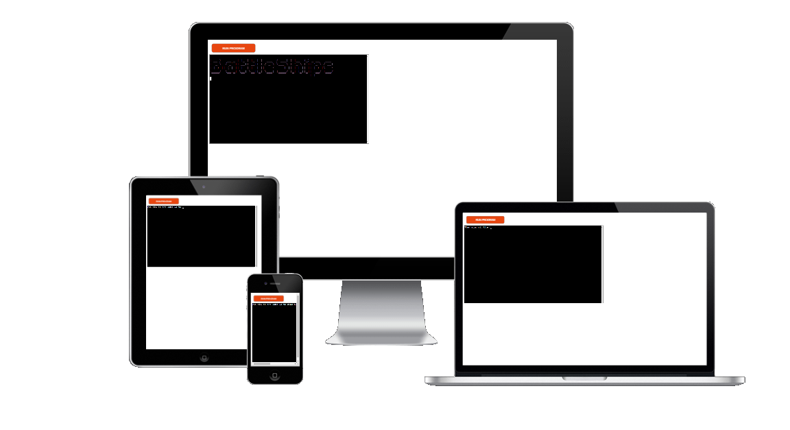

# Carl Ellis

Hi I am Carl I am currently enrolled on a course with Code Institue to gain a level 5 diploma to become a Full Stack Devoloper. I've always had a passion for learning new things and how computers work so I decided to take the plunge on the course and learning to code has become a full time obsession now.
My interests away from coding are Football (LFC), F1, reading books, walking my dogs and my little girl who keeps me so busy it's unbelievable!

## My Tech Stack

  &nbsp;
  &nbsp;
  &nbsp;
  
  
  
  
  
   
  
     
  
  
  

## Contact me
  

## Portfolio projects for Code Institute course

### First Portfolio Project
#### Goals! 5-a-side football
I designed this website for a 5 a side football league based in Scotland. It is my first project as part of my Code Institute course and uses HTML and CSS to build 
a small website with a few internal links.

### Second Portfolio Project
#### Princess Pairs

I created this website using HTML, CSS and JavaScript to create an interactive card matching game. It is my second project as part of my course.

### Third Portfolio Project
#### Battleships
I created a battleship game using Python within a mock terminal. It is the third project as part of my course.

### Fourth Portfolio Project
#### The Final Whistle
I created this site using Django Framework it is a site where users are able to create posts and leave comments on other posts it has full CRUD functionality and allows users to register for an account as well.

It is hosted in the site below.

[The Final Whistle](https://the-final-whistle.herokuapp.com/)

### Fifth Portfolio Project
#### Lifesort

I created this site using React for the front-end and I built a custom API using Djang Rest Framework. It is a task management site allowing the users to set tasks and manage them accordingly it has full CRUD functionality.

It is hosted on the site below

[Lifesort front-end live site](https://life-sort.herokuapp.com/)

## My GitHub Stats

<table>
  <tr>
    <td valign="top" width="50%">
      
    </td>
    <td valign="top" width="50%">
      
    </td>
  </tr>
</table>

<table>
  <tr>
    <td valign="top" width="50%">
      
    </td>
    <td valign="top" width="50%">
      
    </td>
  </tr>
</table>

## My Holopin badge board

<!---
carl2087/carl2087 is a ✨ special ✨ repository because its `README.md` (this file) appears on your GitHub profile.
You can click the Preview link to take a look at your changes.
--->

